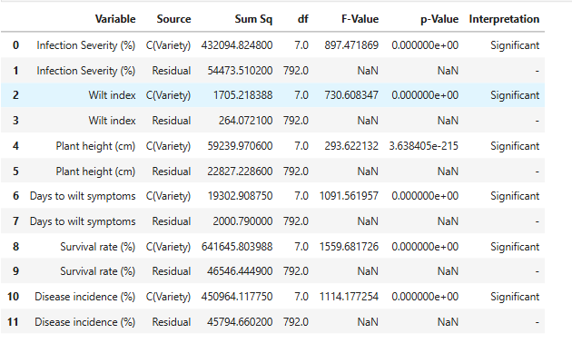
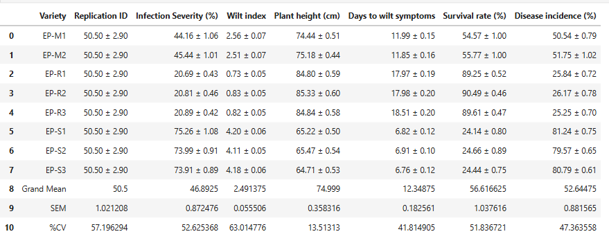
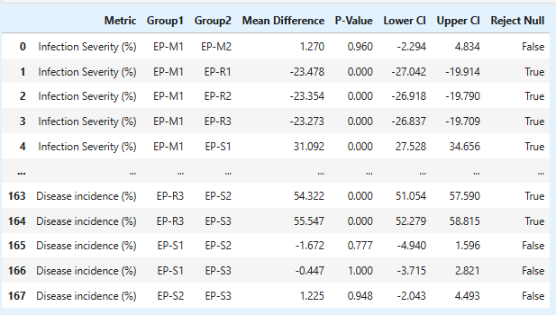
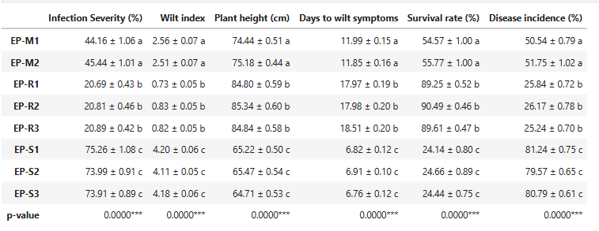
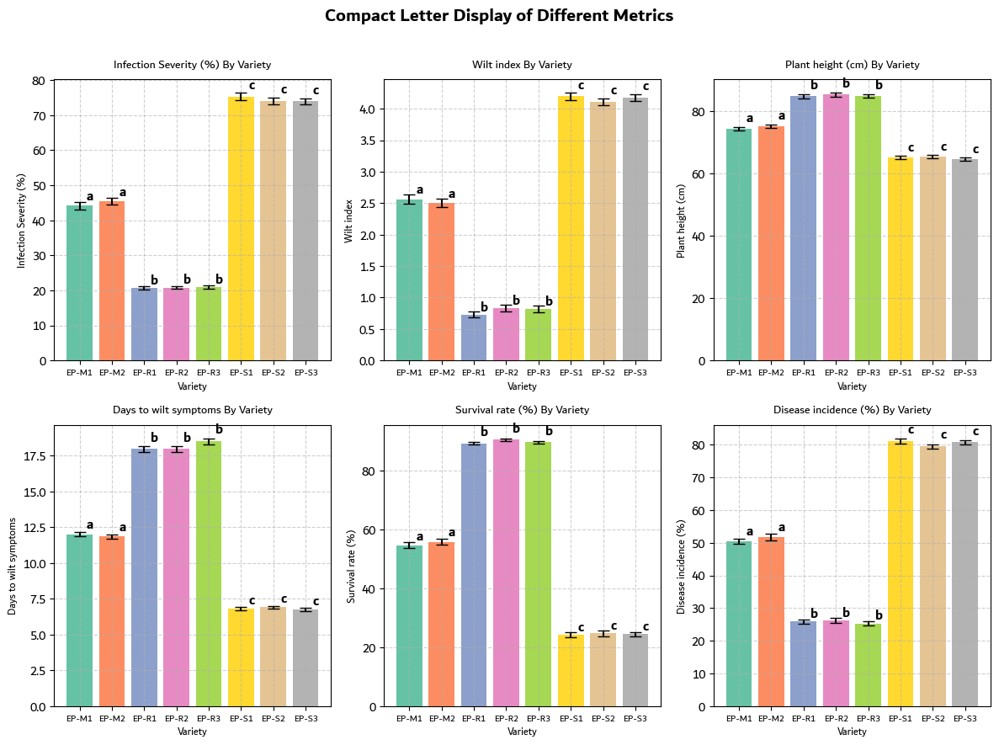

<h1 align = 'center'>Compact Letter Display (CLD) | Post-Hoc Test Grouping Visualization</h1>

This repository offers a comprehensive collection of tools and practical examples for generating **Compact Letter Displays (CLDs)** in Python, typically following **ANOVA** (Analysis of Variance) and **Tukey's HSD** (Honest Significant Difference) tests. CLDs provide a clear and concise way to present multiple group comparison results by assigning letters to groups based on their statistical similarity or difference, making it easy to identify which groups are significantly different. In addition to CLD generation, the repository includes utilities for creating **publication-ready tables**, summarizing **descriptive statistics**, visualizing **data distributions**, and performing **statistical inference**. These features support a complete and streamlined data analysis workflow, making the repository valuable for researchers, analysts, and data scientists aiming to produce accurate, interpretable, and presentation-ready statistical outputs.


## Features

* Perform **Exploratory Data Analysis (EDA)** to explore and summarize data
* Conduct **one-way ANOVA tests** to detect overall differences among group means
* Perform **Tukey’s HSD** post-hoc analysis for detailed pairwise group comparisons
* Generate **Compact Letter Displays (CLDs)** to summarize statistical group differences
* Create **CLD tables** for easy interpretation and reporting
* Produce **publication-ready summary tables** including group means, standard errors, and CLD labels

## 🛠️ Technologies Used

* **Python** – Core programming language for data manipulation, analysis, and visualization.
* **pandas** – For efficient data wrangling, grouping, and summarization.
* **numpy** – For numerical operations and statistical calculations.
* **scipy** – Used for statistical testing, including Shapiro-Wilk and Levene’s tests.
* **statsmodels** – For performing ANOVA and Tukey’s HSD post-hoc comparisons.
* **matplotlib** – For creating detailed, customizable plots.
* **seaborn** – For high-level statistical visualizations and enhanced plotting aesthetics.

## 📂 Project Structure


```
your-repo-name/
│
├── Datasets/                # Sample datasets used in notebooks and scripts
│── Documents/               # Documentation and reports  
├── Notebooks/               # Jupyter notebooks with step-by-step analysis examples
├── Outputs/                 # Generated tables, plots, and reports
├── Scripts/                 # Reusable Python scripts and functions for analysis
├── requirements.txt         # List of required Python packages
├── README.md                # Project overview and instructions
└── LICENSE                  # License information
```

## Installation & Setup

1. **Clone the repository**

   ```bash
   git clone [https://github.com/your-username/your-repo-name.git](https://github.com/Jabulente/Compact-Letter-Display-CLD-Post-Hoc-Test-Grouping-Visualization.git)
   cd Compact-Letter-Display-CLD-Post-Hoc-Test-Grouping-Visualization
   ```

2. **Create and activate a virtual environment** (optional but recommended)

   ```bash
   python -m venv venv
   source venv/bin/activate  # On Windows use: venv\Scripts\activate
   ```

3. **Install the required Python libraries**

   ```bash
   pip install pandas numpy statsmodels scikit-posthocs seaborn matplotlib scipy
   ```

4. **Exploration**

   * **Jupyter Notebooks:**
     Navigate to the `/Notebooks` directory to find interactive notebooks demonstrating how to perform ANOVA, Tukey’s HSD tests, generate Compact Letter Displays (CLDs), visualize data, and produce summary tables. These notebooks serve as guided tutorials and practical examples.
   
   * **Python Scripts:**
     The `/Scripts` folder contains modular scripts for data processing, statistical analysis, CLD generation, and table creation. You can run these scripts standalone or integrate them into your own data analysis pipelines.


## 📊 Results and Outputs

This project generates a complete statistical summary pipeline, from ANOVA testing to compact letter visualization. Below are examples of the key outputs produced:

1. **ANOVA Table**

Displays variance partitioning, F-values, and p-values across groups.



2. **Group Mean Comparative Analysis**

Summarizes the mean and standard error of each group for interpretation and plotting.




3. **Tukey’s HSD Results**

Shows pairwise group comparisons with mean differences, confidence intervals, and significance status.





4. **Compact Letter Display (CLD) Table**

Assigns letter labels to each group based on statistical similarity.



5. **CLD Plot**

Visualizes group means with CLD annotations, making interpretation intuitive.




## Usage Example

```python
from scripts.anova_tukey_cld import run_anova_and_cld
from scripts.summary_tables import generate_summary_table

cld_df = run_anova_and_cld(data, group_col='Treatment', value_col='Yield')
summary = generate_summary_table(data, group_col='Treatment', value_col='Yield', cld_df=cld_df)
print(summary)
```


## 🤝 Contributing

Contributions are welcome! You can:

* 📦 **Add new features** or enhance existing functionality
* 🐛 **Report bugs** or suggest improvements by opening issues
* 🧪 **Improve test coverage** or validation procedures
* 📚 **Update documentation**, fix typos, or add usage examples
* 📊 **Share new datasets or use cases** to expand project utility

To contribute:

1. Fork the repository
2. Create a new branch
3. Make your changes
4. Commit and push
5. Open a pull request for review

We appreciate all contributions, big or small. Let’s build something useful together!


## License

This project is licensed under the MIT License.
